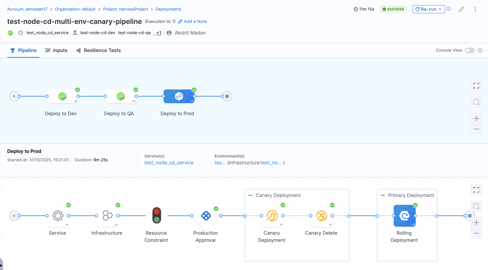
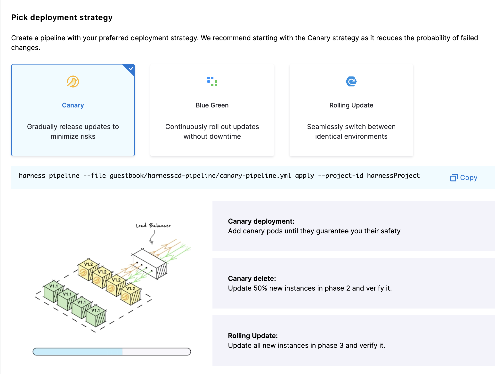
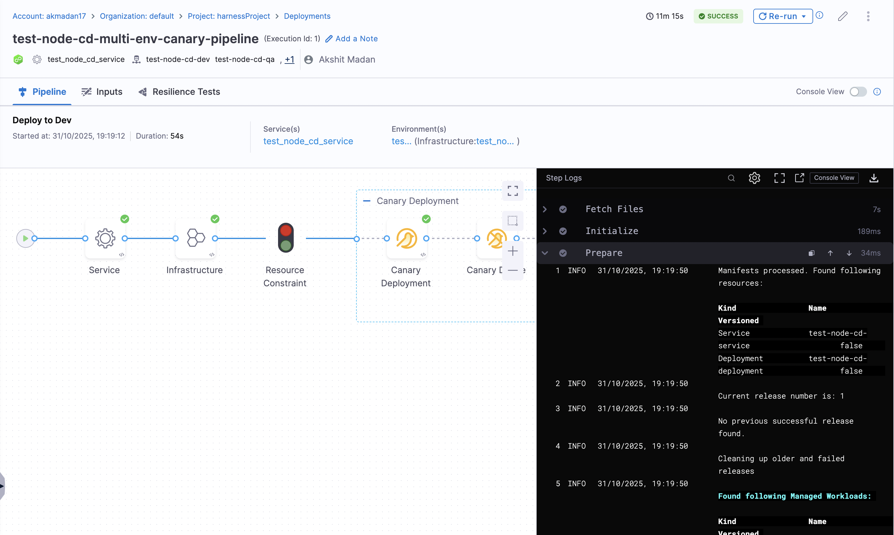
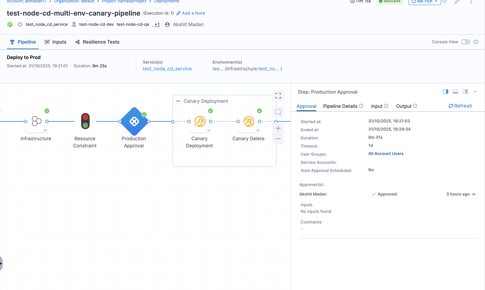
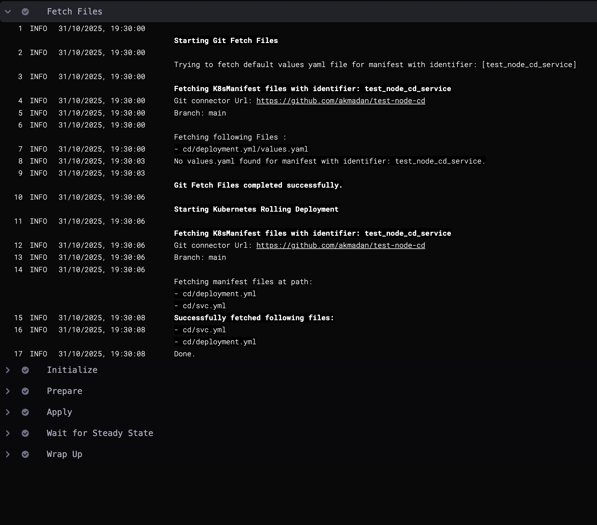
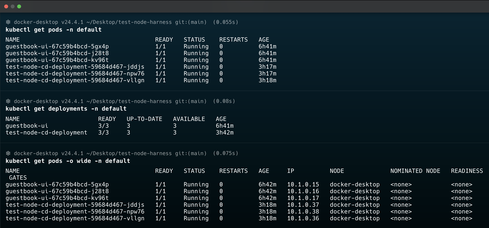

# Harness CD Pipeline: Multi-Environment Deployment

This project demonstrates a complete CI/CD pipeline using Harness CD to deploy a Node.js microservice across three Kubernetes environments (Development, QA, and Production) using a canary deployment strategy. The pipeline includes automated deployments for Dev and QA environments, with manual approval gates for Production deployments to ensure controlled releases.

---

## Table of Contents

1. [Pipeline Design](#pipeline-design)
2. [Pipeline Execution](#pipeline-execution)
3. [Running Pod with the Deployed Microservice](#running-pod-with-the-deployed-microservice)
4. [Automation: Harness Entity Creation](#automation-harness-entity-creation)
5. [Feedback on Harness Documentation](#feedback-on-harness-documentation)

---

## Pipeline Design

### Overview

The pipeline is designed to automate deployments to the Dev and QA environments, allowing updates to flow quickly through early validation stages. However, before any deployment reaches Production, an approval gate is enforced - a manual step where a designated team member must review and authorize the release. This approval gate acts as a final safeguard, ensuring that no changes go live in Production without explicit human oversight.

### Architecture

The pipeline consists of three sequential stages - Dev, QA, and Production.



### Deployment Strategy: Canary

We chose the **Canary Deployment Strategy** for all three environments (Dev, QA, and Prod). This section explains why Canary was selected over other available strategies.

#### Available Deployment Strategies

Harness supports three main deployment strategies for Kubernetes:

1. **Rolling Deployment**
2. **Canary Deployment**
3. **Blue-Green Deployment**



#### Why Canary Deployment?

After evaluating all three strategies, Canary Deployment was selected for the following reasons:

##### 1. **Risk Mitigation**
- **Canary**: Deploys to a small subset (1 pod) first, allowing validation before full rollout
- **Rolling**: Updates all pods gradually, but issues affect more users during rollout
- **Blue-Green**: Requires 2x resources and instant switch, but less validation time

**Why it matters**: In production, we can validate the new version on a small subset of traffic before committing to a full deployment. If issues are detected, only a minimal number of users are affected.

##### 2. **Zero Downtime**
- **Canary**: Maintains service availability throughout deployment
- **Rolling**: Maintains availability but may have brief service degradation
- **Blue-Green**: Requires traffic switch, potential for brief connection drops

**Why it matters**: Canary ensures continuous service availability while allowing us to monitor the new version's health before promoting it.

> **Note**: While **Rolling Deployment** could be used for faster deployments in Dev and QA, we chose **Canary Deployment** everywhere for simplicity and safety. This ensures consistency across environments, provides teams with practice using the same strategy as production, and gives a safer rollout even in non-production.

---

## Pipeline Execution

### Overview

This section covers how to execute the pipeline manually, monitor its execution, handle the approval process for Production, and verify successful deployments.

### Prerequisites for Execution

Before executing the pipeline, ensure:

1. All Harness entities are created:
   - Service (`test_node_cd_service`)
   - Environments (Dev, QA, Prod)
   - Infrastructure Definitions for each environment
   - Connectors (GitHub, Kubernetes)
   - Pipeline (`test_node_cd_multi_env_canary_pipeline`)

2. Docker image is built and pushed to Docker Hub
   - Image available at: `akshitmadan/test-node-harness:latest` (or your image tag)

3. Kubernetes manifests are in GitHub repository
   - Files at: `cd/deployment.yml` and `cd/svc.yml`
   - Repository accessible via GitHub Connector

4. Harness Delegate is connected and healthy

### Manual Execution Steps

#### Step 1: Navigate to Pipeline

1. Log in to Harness UI: https://app.harness.io
2. Select your **Project** (e.g., `harnessProject`)
3. Go to **Pipelines** → Select `test-node-cd-multi-env-canary-pipeline`
4. Click **Run** button



#### Step 2: Monitor Execution

The pipeline will execute sequentially through each stage:

Stage 1: Deploy to Dev (Automatic)

Stage 2: Deploy to QA (Automatic)

Stage 3: Deploy to Prod (Manual Approval Required)
- Approval Gate Required
- Pipeline pauses and waits for manual approval
- Notification sent to approvers

### Production Approval Process

When the pipeline reaches the Production stage, it will pause and require manual approval:

#### Approval Request

1. **Approval Notification**: Approvers receive notification
2. **Review Pipeline Execution**: View previous stages (Dev, QA) results
3. **Review Artifact**: Check which image version is being deployed
4. **Approve or Reject**: Make decision based on Dev/QA results



#### Approval Details

The approval step includes:
- **Approval Message**: Context about the deployment
- **Artifact Information**: Image tag being deployed
- **Pipeline History**: Execution history of Dev and QA stages
- **Environment**: Production environment details

#### Approving the Deployment

1. Click **Approve** button
2. Add optional approval message
3. Confirm approval

#### After Approval

Once approved:
- Canary deployment starts in Production
- Monitor production deployment logs
- Validate canary health
- Full rollout begins after canary validation

### Execution Monitoring

#### Viewing Logs

1. Click on any stage in the pipeline execution view
2. Expand step groups to see individual steps
3. View real-time logs for each step
4. Monitor canary deployment progress



---

## Running Pod with the Deployed Microservice

After successful pipeline execution, you can verify that the microservice is running in your Kubernetes cluster. This section covers how to check the running pods and verify the deployment.

#### Commands to Check Running Pods

**1. List all pods in the namespace:**

```bash
kubectl get pods -n <your-namespace>
```

Replace `<your-namespace>` with your namespace (e.g., `default` as configured in the infrastructure definitions).



---

## Automation: Harness Entity Creation

### Overview

Harness provides multiple ways to automate the creation and management of entities (pipelines, environments, services, connectors, etc.). This section covers the different automation methods available.

### Automation Methods

#### 1. **Harness CLI (Command Line Interface)**

**What**: Command-line tool for managing Harness resources

```bash
# Create entities (Service, Environment, Infrastructure)
harness service --file cd/service.yml apply --project-id harnessProject
harness environment --file cd/environment-prod.yml apply --project-id harnessProject
harness infrastructure --file cd/infrastructure-definition-qa.yml apply --project-id harnessProject <org>
```

**Advantages**:
- Simple command-line interface
- Good for scripting and automation
- Quick setup for batch operations

**Use Case**: Initial setup scripts, CI/CD integration, batch operations

---

### Automating via Connectors

Connectors are essential for Harness to communicate with external systems. Here's how to automate the creation of GitHub and Kubernetes connectors.

#### GitHub Connector Automation

**Configuration File**: `cd/github-connector.yml`

**Using Harness CLI**:
```bash
harness connector --file cd/github-connector.yml apply --git-user akmadan --project-id TestProjectDevRel
```


---

#### Kubernetes Connector Automation

**Configuration File**: `cd/kubernetes-connector.yml`

**Using Harness CLI**:
```bash
harness connector --file cd/kubernetes-connector.yml apply --delegate-name test-helm-delegate --project-id harnessProject
```

**Suggestion for Automation** - Add a shell script that automates the creation of Kubernetes connector.
The documentation could provide a shell script that automates validation and setup verification, making it easier for developers to ensure their configuration is correct before attempting pipeline execution.

The script will show the user the following information:

# Output would include:
- [✓] Validating YAML files...
- [✓] Checking connectors...
- [✓] Validating environments...
- [✓] Verifying infrastructure definitions...
- [✓] Checking services...
- [✓] Validating pipelines...
- [✓] Checking delegate connectivity...

Configuration Summary:
- Project: harnessProject
- Organization: default
- Connectors: 2 (GitHub, Kubernetes)
- Environments: 3 (Dev, QA, Prod)
- Services: 1 (test_node_cd_service)
- Pipelines: 1 (test_node_cd_multi_env_canary_pipeline)

Harness UI Links:
- Pipeline: https://app.harness.io/.../pipelines/test_node_cd_multi_env_canary_pipeline
- Environments: https://app.harness.io/.../environments
- Connectors: https://app.harness.io/.../connectors


---

## Feedback on Harness Documentation

Based on my experience setting up this pipeline, here is constructive feedback on how the [Harness CD documentation](https://developer.harness.io/docs/continuous-delivery/get-started/cd-tutorials/ownapp/?interface=ui) could be improved:

### 1. **Missing Screenshots**

The documentation lacks screenshots at critical steps, making it difficult for first-time users to follow along.

**Recommendation**: Add screenshots for:
- Harness UI navigation to key pages (Pipelines, Environments, Services)
- Connector creation steps in the UI
- Pipeline execution and monitoring views
- Approval gate interface
- Pipeline execution logs and status indicators

### 2. **Missing Parameter Replacement Guide**

When cloning or using sample app (guestbook - provided in the documentation), the documentation doesn't clearly indicate which parameters need to be replaced in the provided YAML files for custom projects.

**Recommendation**: Add a dedicated section that explicitly lists:
- **Account-specific parameters** to replace:
  - `projectIdentifier` (e.g., `TestProjectDevRel`, `harnessProject`)
  - `orgIdentifier` (e.g., `default`)
  - `accountId` or account identifiers
  
- **Connector-specific parameters** to update:
  - GitHub username (`GITHUB_USERNAME` or actual username)
  - GitHub repository URL
  - Delegate name (`DELEGATE_NAME`)
  - Secret references (e.g., `harness_gitpat`)
  
- **Infrastructure-specific parameters** to configure:
  - Namespace (`default` or custom namespace)
  - Kubernetes cluster connection details
  - Environment names and identifiers

- **Service-specific parameters** to modify:
  - Service names and identifiers
  - Docker image paths
  - Repository names and branches